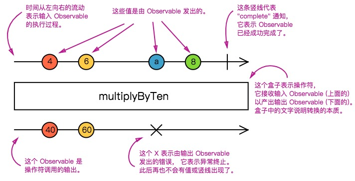

# RxJs 响应式编程

> 以前听说过该库, 学`Angular`的时候又接触到该库, 是`Observable`的`JavaScript`实现. 类似事件操作的`Lodash`

`RxJs`中, 有一个核心类型 `Observable`, 表示一个可调用的未来值或事件的集合
* `Observable` (可观察对象)
* `Observer` (观察者)
* `Subscription` (订阅)
* `Operators` (操作符)
* `Subject` (主体)
* `Schedulers` (调度器)

`RxJs`具有 纯净性, 流动性 的特征.  
纯净性保证了不会改变应用里的其它变量.  
流动性会使事件会经过一系列操作符,从而执行  
流经`observable`的值, 也可以对其进行转换

## `Observable`(可观察对象)
`Observables`是多个值的惰性推送集合.

### 拉取(Pull) 和 推送(Push)
数据生产者(Producer)
数据消费者(Consumer)

||生产者|消费者|
|:--:|:--:|:--:|
|拉取|被动的: 当被请求时产生数据。|主动的: 决定何时请求数据。|
|推送|主动的: 按自己的节奏产生数据。|被动的: 对收到的数据做出反应。|

拉取: 消费者从生产者那拉取数据. 生产者不知道什么时候给消费者传数据
推送: 生产者把数据推送给消费者. 消费者不知道什么时候会接收到数据

||单个值|多个值|
|:--:|:--:|:--:|
|拉取|`Function`|`Iterator`|
|推送|`Promise`|`Observable`|

* `Function` 消费者调用该方法获取数据
* `Generator` 消费者通过调用该方法, 并执行 next, 能获取到多个数据
* `Promise` 生产者通过该方法, 在`.then`将数据传给消费者
* `Observable` 生产者可通过该方法, 源源不断的将数据传给消费者

### `Observable`作为函数的泛化
> `Observables` 像是没有参数, 但可以泛化为多个值的函数
`Observables`创建的方法, 不会马上执行, 而是在订阅之后, 才会执行.  
对`Observables`进行了几次订阅, 则会执行几次方法.  
这就是`Observables`作为函数的泛化  
> `Observables`传递值可以是同步的, 也可以是异步的
```
const observable = Rx.Observable.create(observer => {
  // 同步返回值
  observer.next(1);
  setTimeout(() => {
    // 异步返回值
    observer.next(2);
  }, 1000);
});
```

### `Observable`剖析
`Rx.Observable.create`或创建操作符能**创建**出 `Observable`, 并且使用观察者来**订阅**它(`subscribe`), 订阅后会**执行**它, 并发送 `next/error/complete`给观察者, 执行时也有可能会被**清理**
* 创建 `Observables`
  ```
  Rx.Observable.create(subscribe: function)
  ```
接受一个参数: `subscribe`函数. 这个只服务于给定的观察者.
* 订阅 `Observables`
  ```
  observable.subscribe(x => console.log(x))
  ```
  `observable.subscribe`的每次调用都会触发针对给定观察者的独立设置.每次调用只是启动了本次的`observable`执行, 并将值或事件传递给本次执行的观察者
* 执行 `Observables`
  `Rx.Observable.create`这里面的`subscribe`函数, 只是一个惰性运算. 只有在订阅后才会执行.
  执行的时候可传递三种类型的值:
  * `Next`通知, 发送一个值
  * `Error`通知, 发送一个错误或异常
  * `Complete`通知, 完成, 不再发送任何值
  `Next`可能会执行零到无数次. 而`Error`和`Complete`只执行一次.
* 清理 `Observables`
  `Observable`执行可能会是无限次. 可通过执行`observable.subscribe`返回的`subscription`对象的`unsubscribe`方法可取消订阅.

----

## `Observer`(观察者)
观察者即, 生产者和消费者中的消费者. 接受`Observable`发送的值, 是一组回调函数的集合.
```
const observer = {
  next: x => console.log(x),
  error: err => throw err
  complete: () => console.log('complete')
}
// 使用观察者
observable.subscribe(observer)
```
如果传入的是一个回调方法, 而不是回调方法集合, 则默认创建一个观察者对象并使用该回调方法作为`next`的处理方法

----
## `Subscription`(订阅)
`Subscription`表示可清理资源的对象, 通常是`Observable`的执行, 带有一个`unsubscribe`方法, 通过执行这个, 可清除掉订阅
`Subscription` 可通过`add`或`remove`来合并或撤销`Subscription`

----
## `Subject`(主体)
`Subject`是一种特殊类型的`Observable`, 允许将值多播给多个观察者.
* 每个 Subject 都是 Observable
* 每个 Subject 都是观察者
`Subject`还有几种特殊的`Subject`: `BehaviorSubject`、`ReplaySubject`和`AsyncSubject`

### 多播的`Observables`
多播`Observables`通过`Subject`来发送通知. 单播`Observables`则值发送给单个观察者
`multicast`操作符的工作原理就是在底层调用了`subject`, 返回的是一个`Observable`. 可进行订阅, 订阅后, 通过它本身的`connect`方法, 即可多播到订阅的所有观察者
#### 引用计数
通过多播返回的`refCount`方法, 可追踪订阅者数量. 当有订阅则时, 则自动执行`connect`, 订阅者为空时, 自动停止执行

### `BehaviorSubject`
`Subject`的一个变体. 会保存发送给消费者的最新值. 当有新的观察者订阅时, 会立即接受到当前的值

### `ReplaySubject`
`ReplaySubject`会将旧值集合发给新的订阅者. 可通过`ReplaySubject`的第一个参数 来确定缓冲多少个值, 第二个参数来确定保存的时间
```
new Rx.ReplaySubject(count, time)
```

### `AsyncSubject`
只有`Observable`执行完成时, 才将最后个值发送给观察者

----
## `Operators`(操作符)
操作符是 `Observable`类型上的方法.每个操作符都会在当前的`Observable`上, 返回一个新的`Observable`以实现链式调用. 纯函数, 无副作用, 不会影响到原先的`Observable`  
根据以上概念, 可自己实现一个自定义的操作符.
```
// input 传入的 Observable
function multiplyByTen (input) {
  const output = Rx.Observable.create(function subscribe (observer) {
    // 在原本的 Observable 上设置观察者
    input.subscribe({
      // 在新的 Observable 执行触发
      next: x => observer.next(x * 10)
    })
  })
  // 返回新的 Observable
  return output
}

const input = Rx.Observable.from([1, 2, 3, 4])
// 自定义操作符
multiplyByTen(input)
  // 订阅新的 Observable. 导致老的 Observable 也被订阅. 为 操作符订阅链
  .subscribe(x => console.log(x))
```

### 实例操作符. 静态操作符
#### 实例操作符
默认提到的操作符都为实例操作符, 是`Observable`实例上的方法. 方法中使用`this`作为原来老的`Observable`  
`Rx.Observable.prototype.xxx = function () {}`为实例操作符. 方法中的 `this` 指代的就是老的`Observable`  

#### 静态操作符
静态操作符只接受非`Observable`对象, 基本为创建操作符. 内部不使用 this. 相反的, 创建操作符会根据参数, 来创建新的`Observable`  
组合操作符也有可能是静态. 会将传入的多个 `Observable`组合成新的`Observable`返回出去.

#### Marble diagrams(弹珠图)
  
（图片来自：[RxJS中文文档](http://cn.rx.js.org/manual/overview.html))

#### 操作符分类
* 创建
* 转换
* 过滤
* 组合
* 错误处理
* 工具

点击[链接](http://cn.rx.js.org/manual/overview.html#h213)查看

--
## `Scheduler`(调度器)
调度器控制何时启动`subscription`和何时发送通知
* 一种数据结构. 根据优先级或其它标准来存储任务和将任务排序
* 执行上下文. 表示在何时何地执行任务
* 虚拟时钟. 调度器通过它的`getter`方法获取时间

调度器可让你规定`Observable`在什么样的执行上下文中发送通知给它的观察者

```
const observable = Rx.Observable.create(function (observer) {
  observer.next(1);
  observer.next(2);
  observer.next(3);
  observer.complete();
})
  // 操作符. 指定调度器
  .observeOn(Rx.Scheduler.async)

console.log('just before subscribe')
observable.subscribe({
  next: x => console.log('got value ' + x),
  error: err => console.error('something wrong occurred: ' + err),
  complete: () => console.log('done'),
})
console.log('just after subscribe');
```

### 调度器类型
|调度器|目的|
|:--|:--|
|null|同步递归发送通知, 用于定时操作或尾递归|
|Rx.Scheduler.queue|队列调度, 用于迭代操作|
|Rx.Scheduler.asap|微任务的任务调度, 用于异步转换|
|Rx.Scheduler.async|使用 setInterval 的调度, 基于时间的操作符|
### 使用调度器
使用`subscribeOn`来调度`subscribe()`调用在什么样的上下文中执行


