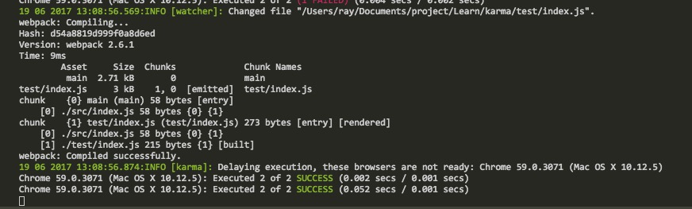
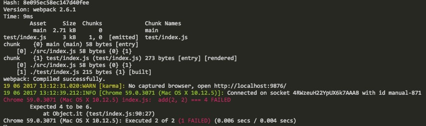

# Karma

> 接触并开发`JS`已经有一年多了, 开发过程中, 深知单元测试的重要性, 然而一直都没时间去学习如何进行单元测试. 今天就抽空去学习下 `Karma` 自动化测试框架

## 什么是`Karma`
`Karma`是 `angular`团队自己开发的自动化测试框架. 使得开发变得更加简单.

## 安装`Karma`.
```
// 安装karam的脚手架.
npm i -g karma-cli
// 初始化项目
karma init
```
按照步骤一步步完成后, 会在项目中生成一个`karma.conf.js`配置文件.

## 运行`Karma`
分别在 `src`以及 `test`文件夹添加相应的代码,
运行
```
karma start
```
> 看到以下代码表示运行成功.  



> 失败  


